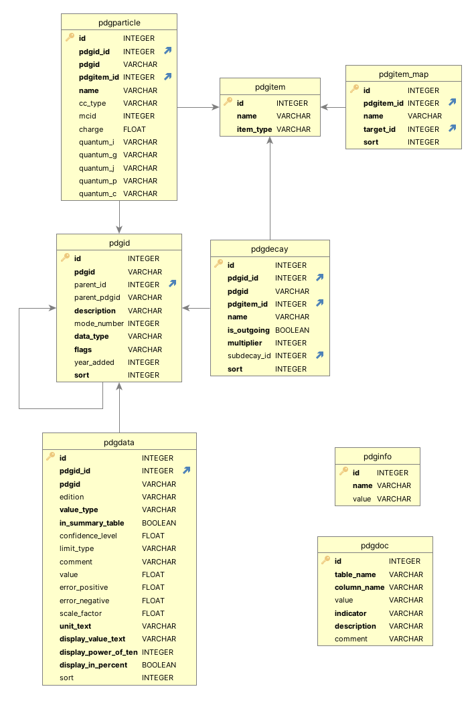

# PDG database file

The PDG database file contains the data from one edition of the *Review of Particle Physics*
in a single file in [SQLite (version 3)](https://sqlite.org/index.html) format.
Depending on what version of the file was obtained, Summary Table values from previous
editions may also be included.
The database file provides the default data store for the [Python API](pythonapi.md) and a copy is bundled
with and installed when the Python API package [`pdg`](https://pypi.org/project/pdg/) is installed.

Available database files can be downloaded from the
the [API page on the PDG website](https://pdg.lbl.gov/api).

In contrast to the Python API, the database file provides relatively low-level access to PDG data.
Its use requires not only the technical expertise for querying the PDG data in SQL, but also a good understanding
of how PDG data is organized, how different flags are used, and how special cases have to be treated.
The documentation in this chapter tries to provide the minimum information necessary to start using the database
file. Users who wish to do so are encouraged to consult the
[source code of the Python API](https://github.com/particledatagroup/api) 
as a "reference implementation" to see how PDG data can be extracted.
Please note that PDG can provide at best limited support for using the database file.

## Database schema

The database file contains the following database tables:

* `pdgid` is the lookup table for [PDG Identifiers](pdgidentifiers.md) and provides the central index
  on what data is available. Data tables such as `pdgdata` use foreign keys to `pdgid` to specify
  the quantity for which data in a given row is provided. As a convenience to software developers
  and others querying the data, the PDG Identifiers (`pdgid.pdgid`) are duplicated in other data tables.
  Nevertheless, such tables should only be joined with table `pdgid` using the primary key `pdgid.id` of the `pdgid` table.
* `pdgdata` contains the data provided in the Summary Tables of the *Review of Particle Physics*.
* `pdgparticle` contains the mapping between PDG Identifiers and particle names, their Monte Carlo
  particle numbers, and additional information such as quantum numbers. `pdgparticle` contains a separate
  entry for each possible charge of a particle. The particle names in `pdgparticle` are the standard names
  in ASCII format following the PDG naming conventions. 
* `pdgitem` is a reference table that defines the unique names of all particles, aliases, shortcuts,
  sets of names, as well as any other strings used by the PDG API.
  The type of each entry is given by `pdgitem.item_type`.
  The possible types are documented in table `pdgdoc` (see below).
* `pdgitem_map` provides a generic one-to-many mapping mechanism. It is used to define e.g. particle
  aliases, previously used particle names, as well as the mappings between generic particle
  names such as _B_ (which do not specify a specific charge) and the actual particles this may designate
  (in this example, _B+_, _B0_, _Bbar0_, and _B-_).
* `pdgdecay` provides for each decay (specified by it's PDG Identifier) the incoming and outgoing particles. The `multiplier` entry is
  used to indicate if a particle or decay product appears multiple times. `subdecay_id` specifies that
  the given decay product needs to decay in a specific way. Concatenating the entries in `pdgdecay` for
  a given decay in the order given by `sort` results in the decay string as provided by the description
  of the corresponding PDG Identifier.
  Note that each decay product is a `pdgitem` that may or may not be mapped to one or several
  particles using `pdgitem_map`. However, not all decay products are mapped to individual particles.
  For example _anything_ or _X_ are used in inclusive decays to specify further decay products.
* `pdgmeasurement` is the central table for individual measurements from the
  literature. It contains general information for each measurement, such as the
  event count and confidence level, as well as foreign keys into the `pdgid` and
  `pdgreference` tables.
* `pdgmeasurement_values` contains information on the values associated with
  each measurement, including their central values, their errors, and whether
  they are used in PDG fits or averages.
* `pdgreference` contains information on each literature reference, such as its
  title, DOI, and year of publication. It is linked to `pdgmeasurement` by that
  table's `pdgreference_id` column.
* `pdgfootnote` contains the text of each footnote displayed in the Particle
  Listings, as well as the PDG Identifier for the section in which the footnote
  appears.
* `pdgmeasurement_footnote` provides a one-to-many mapping between
  `pdgmeasurement` and `pdgfootnote`.
* `pdgtext` contains the text of section headers in the Particle Listings.
* `pdgid_map` provides a general many-to-many mapping between PDG Identifiers,
  for example between branching ratios and branching fractions.
* `pdginfo` provides metadata about the contents of the database file, such as the edition of the
  _Review of Particle Physics_ from which the data was extracted, version and citation information.
* `pdgdoc` serves as a documentation table for the different codes and flags used in other tables.

The figure below summarizes the database schema and the columns of each table.
Arrows represent foreign key relations. Bold column names indicate constraints.
Further details about the database file as well as examples of how to use it will be provided in the future.



## Usage example

To give a concrete example of how the PDG SQLite database files could be used, the SQL snippet below produces a table of
branching fractions for the charged pion.

```sql
SELECT pdgid.pdgid,
       description,
       value AS branching_fraction,
       limit_type,
       value_type
FROM   pdgid
       JOIN pdgdata
         ON pdgdata.pdgid_id = pdgid.id
WHERE  pdgid.parent_pdgid = 'S008'
       AND data_type = 'BFX'
       AND edition = '2024'
ORDER  BY pdgid.sort;
```
In this example:
- Tables `pdgid` and `pdgdata` are joined. The former is used to select and show the specific decay and the latter to get data values.
- `pdgid.parent_pdgid='S008'` selects charged pions using their PDG Identifier.
- `data_type='BFX'` selects exclusive non-indented branching fractions.
- `edition='2024'` selects data from the 2024 edition (assuming this data is available in the SQLite file being used).
- `limit_type` will either be NULL (in case a value is not a limit), or a code to denote the type of limit the corresponding value represents.
- `value_type` is a code indicating whether this is an average, fit value, best limit etc.
- Indented branching fractions are not included for two reasons: first, the `parent_pdgid` of an indented decay is the PDG
  Identifier of the higher-level decay (such as e.g. S008.1), and second its `data_type` will indicate the indentation (e.g. `BFX1` instead of `BFX`).
- `value` is the raw, numerical value without any rounding applied. To get the
  value rounded and formatted as shown in the PDG Summary Tables use `display_value_text` instead of `value`
  (which will also show the error and indicate limits). The `pdgdata` table of course also provides numerical values
  for errors, units, and more.

Specific values of flags and other codes such as the ones found in `data_type`, `limit_type` or `value_type`are documented in table `pdgdoc`.
For example, to see what values `limit_type` can have, one can use:
```sql
SELECT value,
       description
FROM   pdgdoc
WHERE  table_name = 'PDGDATA'
       AND column_name = 'LIMIT_TYPE';  
```
which might produce
```
| value |                 description                 |
|-------|---------------------------------------------|
|       | NULL means not a limit (i.e. a measurement) |
| L     | lower Limit                                 |
| R     | range                                       |
| U     | upper Limit                                 |
| X     | range exclusion                             |
```

## License

The data obtained from the PDG REST API is subject to the license used by the corresponding edition
of the _Review of Particle Physics_. 
Starting with the 2024 edition, the _Review of Particle Physics_ is published under a
[CC BY 4.0](https://creativecommons.org/licenses/by/4.0/) license.
