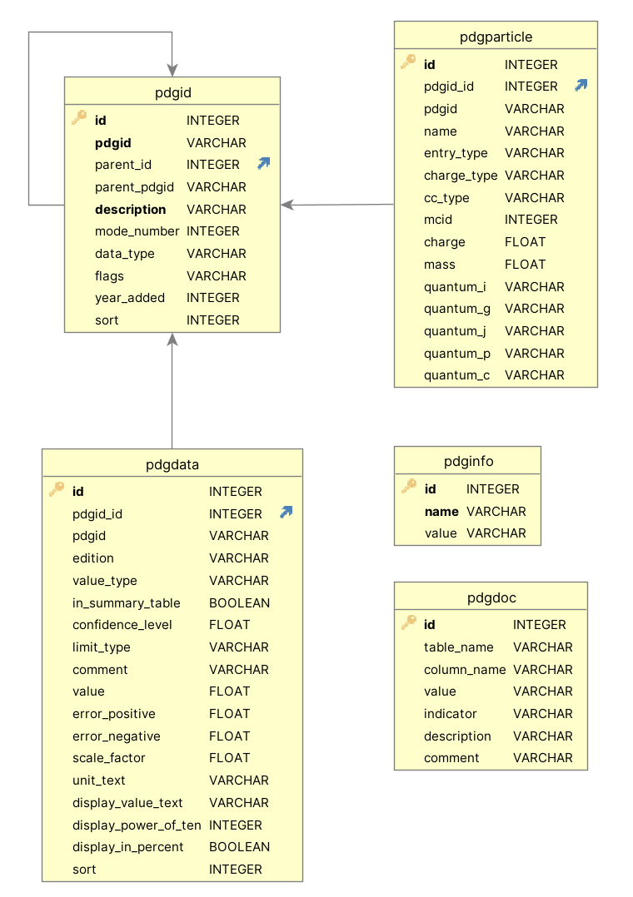

# PDG database file

The PDG database file contains the data from one edition of the *Review of Particle Physics*
in a single file in [SQLite](https://sqlite.org/index.html) format.
Depending on what version of the file was obtained, Summary Table values from previous
editions may also be included.
The database file provides the default data store for the [Python API](pythonapi.md) and a copy is bundled
with and installed when the Python API package [`pdg`](https://pypi.org/project/pdg/) is installed.

Available database files can be downloaded from the
the [API page on the PDG website](https://pdg.lbl.gov/api).

In contrast to the Python API, the database file provides relatively low-level access to PDG data.
Its use requires not only the technical expertise for querying the PDG data in SQL, but also a good understanding
of how PDG data is organized, how different flags are used, and how special cases have to be treated.
The documentation in this chapter tries to provide the minimum information necessary to start using the database
file. Users who wish to do so are encouraged to consult the
[source code of the Python API](https://github.com/particledatagroup/api) 
as a "reference implementation" to see how PDG data can be extracted.
Please note that PDG can provide at best extremely limited support for using the database file.

## Database schema

The database file contains the following database tables:

* `pdgid` is the lookup table for [PDG Identifiers](pdgidentifiers.md) and provides the central index
  on what data is available. Data tables such as `pdgdata` use foreign keys to `pdgid` to specify
  the quantity for which data in a given row is provided. As a convenience to software developers
  and others querying the data, the PDG Identifiers (`pdgid.pdgid`) are duplicated in other data tables.
  Nevertheless, such tables should only be joined with table `pdgid` using the primary key `pdgid.id` of the `pdgid` table.
* `pdgdata` contains the data provided in the Summary Tables of the *Review of Particle Physics*.
* `pdgparticle` contains the mapping between PDG Identifiers and particle names and their Monte Carlo
  particle numbers, as well as e.g. quantum numbers.
* `pdginfo` provides metadata about the contents of the database file, such as the edition of the
  _Review of Particle Physics_ from which the data was extracted, version and citation information.
* `pdgdoc` serves as a documentation table for the different codes and flags used in other tables.

The figure below summarizes the database schema and the columns of each table.
Arrows represent foreign key relations. Bold column names indicate constraints.
Further details about the database file as well as examples of how to use it will be provided in the future.

Please note: Users of the current beta version should expect the schema to evolve, possibly in ways that are
not fully compatible with the present version.

## License

The data provided in the PDG database file is subject to the license used by the corresponding edition
of the _Review of Particle Physics_. Starting with the 2022 edition, and until further notice, PDG uses the
[CC BY-NC 4.0](https://creativecommons.org/licenses/by-nc/4.0/) license.
